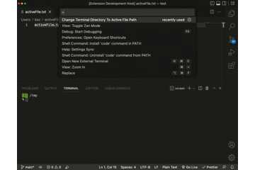

# cdtoactivefiledir-vscode README
## Features

Change terminal path to active file path.

## Known Issues

none

## Release Notes
### 1.0.0

Initial release of cdtoactivefiledir-vscode

---

## Following extension guidelines

Ensure that you've read through the extensions guidelines and follow the best practices for creating your extension.

* [Extension Guidelines](https://code.visualstudio.com/api/references/extension-guidelines)

